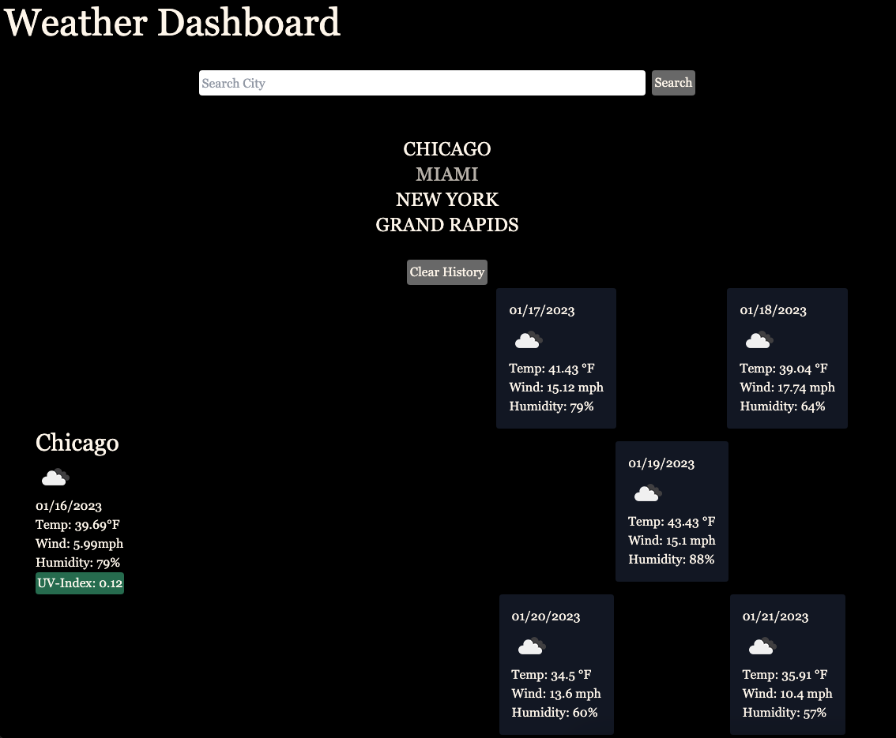

## Weather Dashboard

This application's purpose is to give the user the ability to see the weather for a specific city they searched in current day and a five day forecast. 

## Instalation 

No instalation neccesary, simply the URL to use the Weather Dashboard. 

## Screenshots/Visuals

## Technology

The technologies used for this application were: Html, CSS, JavaScript, and Moment.JS. 

## Credits

[@garethtflynn](https://www.github.com/garethtflynn)

## License 

[MIT](https://choosealicense.com/licenses/mit/)

## Link 

(https://garethtflynn.github.io/WeatherDashboard/)
